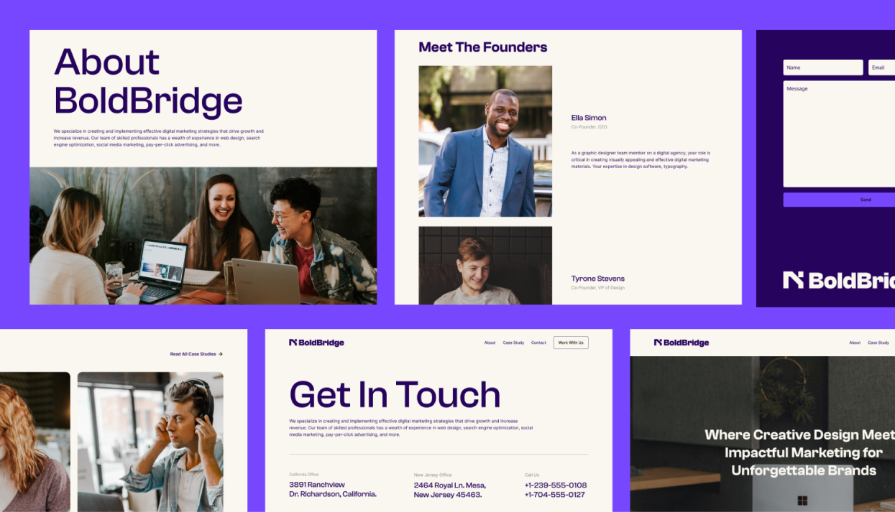

# BoldBridge agency website (Figma to Astro playground)

Image taken directly from Figma file

## 🚀 Project summary

The main idea behing building this project is to start learning about [**Astro**](https://astro.build/), and start playing around with technologies like:

- JAMstack
- Headless CMS
- Tailwind CSS
- and probably an animation library (GSAP)

I'm sure this will be a really cool learning project 🤘

Huge thanks to [**Youness Daoudi**](https://www.figma.com/@younessdaoudi) for sharin the design on Figma Community in [here](https://www.figma.com/community/file/1273869095111887265/boldbridge-agency-website?searchSessionId=ltrfu9wj-mpl7v5vsal).